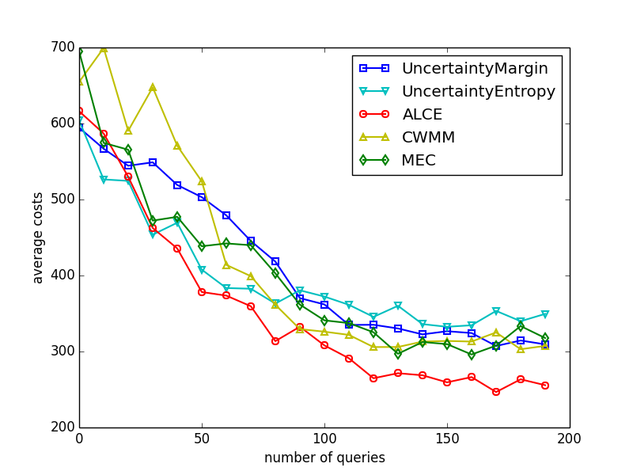

## Cost-Sensitive Multi-Class Active Learning

Python implementation of our paper [A Novel Uncertainty Sampling Algorithm for Cost-Sensitive Multiclass Active Learning](http://ieeexplore.ieee.org/document/7837927/) and related algorithms, including:

- Active Learning with Cost Embedding (ALCE)
- Uncertainty Sampling with Margin (UncertaintyMargin)
- Uncertainty Sampling with Entropy (UncertaintyEntropy)
- Maximum Expected Cost (MEC)
- Cost-Weighted Minimum Margin (CWMM)
- Random Sampling

If you find our paper or implementation is useful in your research, please consider citing our paper for ALCE and the
references below for other algorithms.

    @inproceedings{Huang2016alce,
        author    = {Kuan-Hao Huang and
                     Hsuan-Tien Lin},
        title     = {A Novel Uncertainty Sampling Algorithm for Cost-Sensitive Multiclass Active Learning},
        booktitle = {Proceedings of the IEEE International Conference on Data Mining (ICDM)},
        pages     = {925--930},
        year      = {2016},
    }

### Prerequisites 
- Python 2.7.10
- NumPy 1.9.2
- scikit-learn 0.19.1
- Matplotlib 1.3.1

### Usage 

    $ python demo.py
    
### Dataset

- vehicle (downloaded from [LIBSVM Data](http://www.csie.ntu.edu.tw/~cjlin/libsvmtools/datasets/multiclass.html))

### Result

### Reference

- Simon Tong and Daphne Koller.
  Support Vector Machine Active Learning with Applications to Text Classification.
  Journal of Machine Learning Research, 2001

- Feng Jing, Mingjing Li, HongJiang Zhang, and Bo Zhang.
  Entropy-Based Active Learning with Support Vector Machines for Content-Based Image Retrieval.
  ICME, 2004

- Po-Lung Chen and Hsuan-Tien Lin. 
  Active Learning for Multiclass Cost-Sensitive Classification Using Probabilistic Models. 
  TAAI, 2013

- Kuan-Hao Huang and Hsuan-Tien Lin.
  A Novel Uncertainty Sampling Algorithm for Cost-Sensitive Multiclass Active Learning.
  ICDM, 2016

  

### Author

Kuan-Hao Huang / [@ej0cl6](http://ej0cl6.github.io/)
